# Jitsi Video Hosting Platform - On-Demand, True Scale-to-Zero on AWS

**Self-hosted video conferencing with revolutionary cost control.** Deploy Jitsi Meet on AWS with ECS Express Mode + on-demand NLB lifecycle management, reducing idle costs to just **$0.24/month** (67% better than our $0.73 target).

This is a **production-ready**, **domain-agnostic** platform deployed via **spec-driven infrastructure** (Kiro CLI). Perfect for communities, organizations, and teams who want full control over their video infrastructure without paying for idle resources.

## Quick Start - 5 Step Setup

### Prerequisites
- AWS accounts with IAM Identity Center configured
- Domain name (this repo uses dynamic rotation under `bryanchasko.com`)
- AWS CLI installed: `brew install awscli terraform`
- Perl installed (macOS/Linux default)

### Profile Status

**Current Setup** (December 16, 2025):
- ✅ **DNS Account** (`aerospaceug-admin`): Working, AdministratorAccess confirmed
- ❌ **Infrastructure Account** (`jitsi-hosting`): Requires IAM permission assignment

See [AWS_PROFILE_STATUS.md](https://github.com/BryanChasko/jitsi-video-hosting-ops/AWS_PROFILE_STATUS.md) (private repo) for details.

### Setup Flow

1. **📋 Clone Repositories**
   ```bash
   git clone https://github.com/BryanChasko/jitsi-video-hosting.git
   cd jitsi-video-hosting
   ```

2. **🔐 Configure AWS Authentication**  
   → [IAM_IDENTITY_CENTER_SETUP.md](IAM_IDENTITY_CENTER_SETUP.md) - Set up AWS SSO profile

3. **⚙️ Create Private Configuration**  
   → [CONFIG_GUIDE.md](CONFIG_GUIDE.md) - Set up domain-specific config (your domain, not hardcoded)

4. **🌐 Configure Domain & SSL**  
   → [DOMAIN_SETUP.md](DOMAIN_SETUP.md) - DNS records and ACM certificate

5. **🚀 Deploy Infrastructure**  
   → [DEPLOYMENT_GUIDE.md](DEPLOYMENT_GUIDE.md) - Terraform deployment steps

### Additional Resources

📚 **[AWS_SETUP.md](AWS_SETUP.md)** - AWS account setup and IAM configuration  
🔧 **[TOOLING.md](TOOLING.md)** - AI-assisted development with Kiro CLI  
🧪 **[TESTING.md](TESTING.md)** - Testing and validation  
🏭 **[PRODUCTION_OPTIMIZATION.md](PRODUCTION_OPTIMIZATION.md)** - Security and monitoring  
🤖 **Private Ops Repo** - Create your own for environment-specific details

## Configuration Architecture

This repository is **domain-agnostic** and **profile-agnostic**. Your sensitive configuration lives in a separate private repository:

```
Public Repo (jitsi-video-hosting)
├── Infrastructure code (Terraform)
├── Automation scripts (Perl)
├── Documentation (generic)
└── lib/JitsiConfig.pm (config loader)
         ↓ loads from
Private Repo (your-jitsi-ops)
├── config.json (YOUR domain, YOUR AWS profile)
├── OPERATIONS.md (YOUR procedures)
└── IAM_IDENTITY_CENTER_CONFIG.md (YOUR AWS SSO details)
```

**Key Benefits**:
- ✅ Fork public repo without exposing your domain
- ✅ Keep AWS credentials/profiles private
- ✅ Share code publicly while protecting operations
- ✅ Multiple environments via different config files

See [CONFIG_GUIDE.md](CONFIG_GUIDE.md) for setup details.

## Project Status

| Component | Status | Notes |
|-----------|--------|-------|
| **Infrastructure** | ✅ Production | ECS Express + On-Demand NLB, VPC, S3, SSM Parameters |
| **Video Calling** | ✅ Operational | UDP/10000 primary + TCP/4443 fallback |
| **Scale-to-Zero** | ✅ True Idle | $0.24/month when powered down (97% reduction) |
| **Configuration** | ✅ Domain-Agnostic | No hardcoded domains, uses JitsiConfig module |
| **Documentation** | ✅ Comprehensive | Specs, deployment, testing, operations, blogs |
| **SSL/TLS** | ✅ Configured | Valid certificates via AWS Certificate Manager |
| **AI Development** | ✅ Spec-Driven | Kiro CLI implementation (14 tasks in 5min 8s) |

## Architecture Overview

```mermaid
graph TB
    subgraph "Your Domain"
        A["🌐 Your Domain<br/>meet.yourdomain.com"]
    end
    
    subgraph "AWS - Us-West-2"
        NLB["🔗 Network Load Balancer<br/>Port 443 TLS<br/>Port 10000 UDP"]
        
        subgraph "ECS Fargate Cluster"
            WEB["🌐 Jitsi Web<br/>Port 80"]
            PROSODY["🔊 Prosody<br/>XMPP Server"]
            JICOFO["📞 Jicofo<br/>Conference Focus"]
            JVB["📹 JVB<br/>Video Bridge"]
        end
        
        subgraph "Storage & Secrets"
            S3["🗂️ S3 Bucket<br/>Video Recordings"]
            SECRETS["🔐 Secrets Manager<br/>Component Credentials"]
        end
        
        CW["📊 CloudWatch<br/>Logs & Metrics"]
    end
    
    A -->|HTTPS| NLB
    NLB -->|80| WEB
    NLB -->|10000| JVB
    WEB --> PROSODY
    WEB --> JICOFO
    JICOFO --> JVB
    JVB -->|WebSocket| WEB
    WEB --> S3
    WEB --> SECRETS
    JVB --> CW
```



## Desired Architecture (ECS Express Mode)


- Built-in: Auto-provisioned NLB, listeners, target groups
- Simpler: Condensed task/service config with sane defaults
- Consistent: First-class scale-to-zero patterns remain intact

Learn more in the migration deep dive: `blog/BLOG_JITSI_ECS_EXPRESS.md`.

### Impact of ECS Express on This Project

- Less Terraform: ~55% fewer lines by removing manual NLB/listener/target-group resources.
- Same cost model: Fixed (NLB) + variable (Fargate) costs unchanged.
- Scale-to-zero preserved: `desired_count = 0` by default; operational Perl scripts continue to control scaling.
- Certificates & DNS: ACM certificates and cross-account DNS validation remain the same.
- Health defaults: Express provides sane defaults; our container health checks and timeouts remain compatible.
- Config unchanged: Domain-agnostic design with `JitsiConfig` continues to work without modifications.
/context add variables.tf
#### Terraform Changes (Representative Diff)

```diff
- resource "aws_lb" "jitsi_nlb" { ... }
- resource "aws_lb_listener" "https_443" { ... }
- resource "aws_lb_listener" "udp_10000" { ... }
- resource "aws_lb_target_group" "web_tg" { ... }
- resource "aws_lb_target_group" "jvb_tg" { ... }
- resource "aws_lb_target_group_attachment" "web" { ... }
- resource "aws_lb_target_group_attachment" "jvb" { ... }

// Replaced by ECS Express-managed load balancer and listeners

resource "aws_ecs_service" "jitsi" {
    name            = var.project_name
    cluster         = aws_ecs_cluster.main.id
    launch_type     = "FARGATE"
    desired_count   = 0
    # Express Mode: service annotations/parameters drive NLB setup automatically
}
```

ECS Express config collapses multiple LB resources into service-level configuration while preserving our scale-to-zero and health behavior.

## Cost Model


### Cost Breakdown

**Fixed Costs (Always Running):**
- Network Load Balancer: $16.20/month
- S3 Storage: $0.02/month
- AWS Secrets Manager: $0.40/month
- **Total Fixed: $16.62/month**

**Variable Costs (When Running):**
- ECS Fargate (4 vCPU, 8GB RAM): $0.198/hour

### Usage Scenarios

| Scenario | Hours/Month | Variable | Total | vs. Zoom Pro |
|----------|------------|----------|-------|-------------|
| **Scaled Down** | 0 | $0.00 | **$16.62** | -100% |
| **Light** | 10 | $1.98 | **$18.60** | +49% |
| **Regular** | 60 (2hrs/day) | $12.01 | **$28.63** | +129% |
| **Heavy** | 120 (4hrs/day) | $23.76 | **$40.38** | +223% |
| **Always On** | 744 | $147.31 | **$163.93** | +1212% |

**Key Advantage:** Scale-to-zero saves **$130.31/month** vs always-on deployment (97% savings)

## Features

### ✅ Self-Hosted
- **Full Control**: Your data, your infrastructure, your domain
- **No Third-Party Dependencies**: All video traffic stays within your AWS account
- **100% Open Source**: Built on Jitsi Meet - no proprietary code

### 💰 Cost Optimized
- **Scale-to-Zero**: Automatic power down when idle
- **Predictable Costs**: Fixed costs visible, variable costs per-hour
- **Smart Scheduling**: Scale up before events, down after

### 🔒 Secure
- **End-to-End**: Industry-standard Jitsi encryption
- **AWS Secrets Manager**: Secure credential storage
- **TLS/SSL**: HTTPS by default, valid certificates
- **IAM SSO**: Identity Center integration, no long-lived keys

### 🌍 Domain-Agnostic
- **Your Domain**: Deploy to any domain you own
- **No Hardcoding**: Public repo doesn't expose your domain
- **Configuration Management**: Private `config.json` for secrets
- **Multi-Deployment Ready**: Deploy multiple instances to different domains

### 📊 Observable
- **CloudWatch Logs**: All container logs automatically collected
- **CloudWatch Metrics**: CPU, memory, network monitoring
- **Health Checks**: Automatic target group health verification
- **Status Reporting**: Perl scripts provide detailed status

### 🚀 Operational Tooling
- **Perl Scripts**: Type-safe, reusable operational automation
- **JitsiConfig Module**: Object-oriented configuration management
- **10-Phase Testing**: Automated end-to-end testing
- **Smart Power Management**: Scale-up, scale-down, power-down options

## Repository Structure

This repository is **domain-agnostic** - no hardcoded domains or AWS profiles. Configuration is managed separately in a private repository.

```
jitsi-video-hosting/              # PUBLIC REPO
├── README.md                      # Project overview (you are here)
├── CONFIG_GUIDE.md               # Configuration system documentation
├── DEPLOYMENT_GUIDE.md           # Step-by-step deployment instructions
├── TESTING.md                    # Testing and validation guide
├── TOOLING.md                    # Kiro CLI and development workflow
├── PRODUCTION_OPTIMIZATION.md    # Security and performance tuning
├── AWS_SETUP.md                  # AWS Identity Center setup
├── DOMAIN_SETUP.md               # DNS and SSL configuration
├── CHANGELOG.md                  # Project history and releases
├── main.tf                       # Infrastructure-as-Code (Terraform)
├── variables.tf                  # Terraform variables (no defaults)
├── outputs.tf                    # Terraform outputs
├── lib/
│   └── JitsiConfig.pm           # Configuration management module (OOP)
├── scripts/                      # Operational automation (Perl)
│   ├── status.pl                # Platform status report
│   ├── test-platform.pl         # 10-phase end-to-end testing
│   ├── scale-up.pl              # Scale to 1 instance
│   ├── scale-down.pl            # Scale to 0 instances
│   ├── power-down.pl            # Delete compute (keep storage/NLB)
│   ├── fully-destroy.pl         # Complete infrastructure destruction
│   ├── check-health.pl          # Multi-layer health verification
│   └── project-status.pl        # Detailed status reporting
├── .kiro/steering/              # Kiro CLI context files
│   ├── product.md              # Product goals and vision
│   ├── tech.md                 # Technology stack and preferences
│   └── structure.md            # Repository organization
└── .gitignore                   # Git exclusions

jitsi-video-hosting-ops/        # PRIVATE REPO (Your Configuration)
├── config.json                  # ⚠️ NOT versioned (your secrets here)
├── config.json.template         # Template for setup
├── CONFIG_SETUP.md             # Private repo setup instructions
└── OPERATIONS.md               # Sensitive operational details
```

**Key Principle**: Public repo = reusable code. Private repo = your configuration.

## Configuration System

```mermaid
graph LR
    subgraph "Configuration Sources (Priority Order)"
        ENV["🔧 Environment Variables<br/>JITSI_DOMAIN<br/>JITSI_AWS_PROFILE"]
        PRIVATE["🔐 Private config.json<br/>../jitsi-video-hosting-ops/"]
        DEFAULTS["📝 Code Defaults<br/>lib/JitsiConfig.pm"]
    end
    
    subgraph "JitsiConfig Module"
        CONFIG["🔄 Configuration Loading<br/>Merges all sources<br/>Validates required fields"]
    end
    
    subgraph "Used By"
        SCRIPTS["📜 Perl Scripts<br/>status.pl<br/>scale-up.pl<br/>test-platform.pl"]
        TF["🏗️ Terraform<br/>main.tf<br/>variables.tf"]
    end
    
    ENV -->|highest| CONFIG
    PRIVATE -->|medium| CONFIG
    DEFAULTS -->|lowest| CONFIG
    CONFIG --> SCRIPTS
    CONFIG --> TF
```



**Why This Matters:**
- ✅ Fork this repo and deploy to YOUR domain
- ✅ Your secrets never appear in git history
- ✅ Same code works for everyone
- ✅ Easy to manage multiple deployments

## Quick Testing

### Monthly Cost Breakdown

**Fixed Costs (Always Running):**
- Network Load Balancer: $16.20/month
- S3 Storage: $0.02/month
- AWS Secrets Manager: $0.40/month
- **Fixed Total: $16.62/month**

**Variable Costs (When Running):**
- ECS Fargate (4 vCPU, 8GB): $0.198/hour

### Usage Scenarios

| Usage Pattern | Monthly Hours | Variable Cost | Total Cost |
|---------------|---------------|---------------|-----------|
| **Scaled Down** | 0 hours | $0.00 | **$16.62** |
| **Light Use** | 10 hours | $1.98 | **$18.60** |
| **Regular Use** | 60 hours (2hrs daily) | $12.01 | **$28.63** |
| **Heavy Use** | 120 hours (4hrs daily) | $23.76 | **$40.38** |
| **Always On** | 744 hours | $147.31 | **$163.93** |

### Cost Comparison

| Service | Monthly Cost | Users | Notes |
|---------|--------------|-------|---------|
| **This Platform** | $28.63 | Unlimited | 2hrs daily usage |
| Zoom Pro | $12.49 | 1 host | 40min limit |
| Google Meet | $6.00 | Per user | Enterprise required |
| Microsoft Teams | $4.00 | Per user | Business plan |

**Key Advantage**: Scale-to-zero architecture saves 58% vs always-on deployment

## Quick Testing

To test the deployed platform:

```bash
# Setup testing scripts (Perl-based)
cd scripts/
./setup.pl

# Run complete testing workflow
./test-platform.pl
```

This will:
1. ✅ Scale ECS service from 0 to 1
2. ✅ Verify service health and stability
3. ✅ Test HTTPS access and SSL certificate
4. ✅ Verify Jitsi Meet functionality
5. ✅ Scale back to 0 for cost optimization

### Manual Testing

1. **Start Platform**: `./scripts/scale-up.pl`
2. **Open Browser**: Navigate to your configured domain (https://meet.yourdomain.com)
3. **Create Room**: Enter any room name (e.g., "test-meeting")
4. **Join Call**: Click "Join" - you should see video/audio interface
5. **Stop Platform**: `./scripts/scale-down.pl` (for cost savings)

### Troubleshooting

If you encounter "You have been disconnected":
1. Ensure WebSocket configuration is enabled (already fixed in current deployment)
2. Check JVB logs: `aws logs get-log-events --log-group-name /ecs/jitsi-video-platform`
3. Verify target group health in AWS Console
4. Restart service: `./scripts/scale-down.pl && ./scripts/scale-up.pl`

See **[TESTING.md](TESTING.md)** for detailed testing documentation.

## Deployment Workflow

```mermaid
graph LR
    START["🚀 START<br/>Clone Repo"] -->|1| FORK["🔀 Fork & Clone<br/>Both Repos"]
    FORK -->|2| CONFIG["⚙️ Setup Config<br/>config.json"]
    CONFIG -->|3| AWS["📋 AWS Setup<br/>Identity Center"]
    AWS -->|4| DOMAIN["🌐 Domain Setup<br/>DNS & SSL"]
    DOMAIN -->|5| TF["🏗️ Deploy<br/>terraform apply"]
    TF -->|6| TEST["🧪 Test<br/>./test-platform.pl"]
    TEST -->|7| LIVE{"✅ Success?"}
    LIVE -->|Yes| DONE["🎉 Live!<br/>Ready for Users"]
    LIVE -->|No| DEBUG["🔧 Debug<br/>TESTING.md"]
    DEBUG -->|Fix| TF
    
    style DONE fill:#90EE90
    style START fill:#87CEEB
    style LIVE fill:#FFD700
```



Each step has detailed documentation:
1. **DEPLOYMENT_GUIDE.md** - Complete walkthrough
2. **CONFIG_GUIDE.md** - Configuration details
3. **AWS_SETUP.md** - AWS account setup
4. **DOMAIN_SETUP.md** - DNS and SSL
5. **TESTING.md** - Validation and debugging

## Deployment Success ✅

The platform has been successfully deployed and is **fully operational**:

- ✅ **Video calls working** - WebSocket connectivity enabled
- ✅ **SSL/TLS encryption** - Valid certificates for any domain
- ✅ **Scale-to-zero architecture** - Cost optimization when not in use
- ✅ **Multi-container setup** - All Jitsi components running
- ✅ **AWS Secrets Manager** - Secure credential management
- ✅ **CloudWatch monitoring** - Comprehensive logging and metrics
- ✅ **Domain-agnostic** - No hardcoded values, configuration-driven

### Current Architecture

- **Task Definition**: Multi-container Jitsi stack with WebSocket support
- **Container Count**: 4 containers (jitsi-web, prosody, jicofo, jvb)
- **Resource Allocation**: 4 vCPU / 8GB RAM (configurable)
- **Network**: Network Load Balancer with TLS termination
- **Storage**: S3 bucket for video recordings
- **Cost Optimization**: Automatic scale-to-zero when idle

## Next Steps & Roadmap

```mermaid
graph TD
    A["📍 Current State<br/>Core Platform Live"] -->|Phase 2| B["🔐 Authentication<br/>Cognito/OAuth"]
    B -->|Phase 3| C["🎥 Recording<br/>Jibri Support"]
    B -->|Phase 3| D["📊 Monitoring<br/>Advanced Dashboards"]
    C -->|Phase 3| E["🔒 Security<br/>Hardening"]
    D --> F["✨ Production Ready<br/>Enterprise Features"]
    E --> F
    
    style A fill:#90EE90
    style F fill:#FFD700
```



### Planned Features

- **Phase 2: Authentication & Branding**
  - Cognito authentication for gated access
  - Social login (GitHub, Google)
  - Custom branding for your organization

- **Phase 3: Enhanced Features**
  - Video recording with Jibri service
  - Advanced CloudWatch dashboards
  - Security hardening and compliance
  - Secret rotation automation

## Contributing

This is a reusable reference implementation. If you:
- Find issues or bugs, [open an issue](https://github.com/BryanChasko/jitsi-video-hosting/issues)
- Have improvements, [submit a PR](https://github.com/BryanChasko/jitsi-video-hosting/pulls)
- Want to deploy it yourself, start with [DEPLOYMENT_GUIDE.md](DEPLOYMENT_GUIDE.md)

**Remember**: All domain-specific configuration goes in your private `jitsi-video-hosting-ops` repo, not here.

## License

This project uses [Jitsi Meet](https://github.com/jitsi/jitsi-meet), which is licensed under [AGPL v3](https://www.gnu.org/licenses/agpl-3.0.en.html).

The infrastructure code (Terraform, Perl scripts) is provided as-is for reference and educational purposes.

## Jitsi Application Requirements (The "What")

The chosen hosting platform must satisfy the following technical requirements necessary for a fully functional, secure Jitsi Meet deployment:

| Component | Required Ports | Protocol | Requirement |
| :--- | :--- | :--- | :--- |
| **Web Interface** | 443 | TCP | Mandatory for secure browser access (HTTPS). |
| **Media (JVB)** | 10000 | UDP | **Critical.** Must be open to the internet for direct media transmission. |
| **Internal Communication** | N/A | Localhost | Internal components must be able to communicate via the host network interface (localhost). |
| **TLS/Encryption** | 443 | TLS | A valid, public SSL/TLS certificate for the domain is required. |

## Architectural & Operational Goals (The "How")

Any deployed solution must meet the following operational and cost management objectives:

### Cost Control & Scale-to-Zero

* **Goal:** Scale to zero operational cost when the platform is not in use.
* **Requirement:** The core application compute must be able to scale down to **zero running instances** and back up rapidly to align with scheduled events.
* **Control:** A **deterministic control plane** must be implemented to manage the scale-up (`start`) and scale-down (`stop`) actions.

### Security & Management

* **Developer Access:** Access must be managed using an **Identity Center / SSO** flow, eliminating long-lived access keys.
* **Secrets:** All application secrets must be stored in a dedicated, secure secrets manager (e.g., AWS Secrets Manager).
* **Target Region:** All core infrastructure must be deployed in the **US West (Oregon) - `us-west-2`** region.

---

## Developer Guidance: Effective Infrastructure-as-Code (IaC) Workflow

Use these guidelines to ensure the generated code is accurate and aligns with all project requirements, keeping the entire file structure in mind.

| Infrastructure Goal | Required Context | IaC/GitOps Action |
| :--- | :--- | :--- |
| **Networking** | Entire project files (VPC, Subnet, Security Groups) | Define the necessary Terraform files for the VPC and two public subnets as described in the requirements. |
| **Jitsi Ports** | Project requirements for Jitsi ports (443 TCP, 10000 UDP) | Implement the Network Load Balancer (NLB) resource with the correct listeners and target groups for Jitsi traffic. |
| **Cost Control** | ECS Fargate Service parameters | Write the base ECS Fargate service Terraform, ensuring the initial `desired_count` is set to **`0`** to support the scale-to-zero requirement. |
| **Security** | IAM Policy and Task Definition files | Review the generated IAM Policy for the ECS Task Role against the principle of least privilege, using the established requirements. |

---

## Blog Articles & Learning Resources

### Featured Blog Articles

📖 **[ECS Express Mode Migration Guide](./blog/BLOG_JITSI_ECS_EXPRESS.md)** - How we migrated from standard ECS to ECS Express Mode, reducing Terraform from 1,013 to ~450 lines while maintaining scale-to-zero capabilities. Includes cost comparisons, operational impacts, and lessons learned.

🔧 **[Spec-Driven Infrastructure with Kiro CLI](./blog/BLOG_KIRO_TERRAFORM.md)** - How we set up our VS Code workspace with GitHub Copilot and Kiro CLI to automate infrastructure migrations. Covers spec-driven workflow, workspace configuration, and best practices for AI-assisted IaC development.

### Project Roadmap & Issues

🗺️ **[GitHub Issues & Roadmap](./GITHUB_ISSUES_REVIEW.md)** - Complete roadmap with phases, priorities, and implementation status

🔗 **[GitHub Issues](https://github.com/BryanChasko/jitsi-video-hosting/issues)** - Track specific features, bugs, and improvements on GitHub

📋 **[Change Log](./SESSION_CHANGELOG.md)** - Detailed changelog of all project changes and decisions

---

